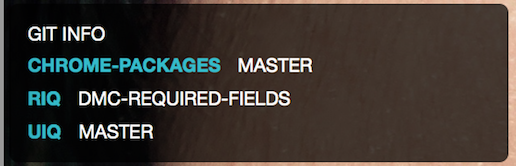

ubersichtGitInfo
================
Allow you to track a list of folders stored in your local machines and their current branches


Ubersicht: (mac osx)
==========
http://tracesof.net/uebersicht/


Configuration
=============
change FOLDER_TO_TRACKS to includes your own folder path
```
FOLDER_TO_TRACKS = [
  '~/projects/riq',
  '~/projects/uiq',
  '~/projects/chrome-packages',
]
```


Screenshot:
===========

